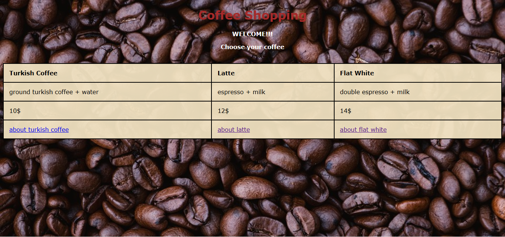

## Coffee Shopping Website ☕  
This project is a simple website that I developed for the first time in 2021 to reinforce my HTML and CSS skills. The main purpose of the project is to better understand and apply the HTML and CSS structure by creating a static web page.
## 🎯 Aim  
Creating an output by applying HTML and CSS knowledge.
Understanding static website structure and developing a simple user interface.
Using basic HTML elements such as tables and links in the project.
## 🌟 Features  
A nice coffee theme in the background.
A table with information about various types of coffee.
Access to Wikipedia links about coffees.
A user-friendly experience with links that open in a new tab.  
## 🖼️ UI  
Below is an image of the project's user interface:

